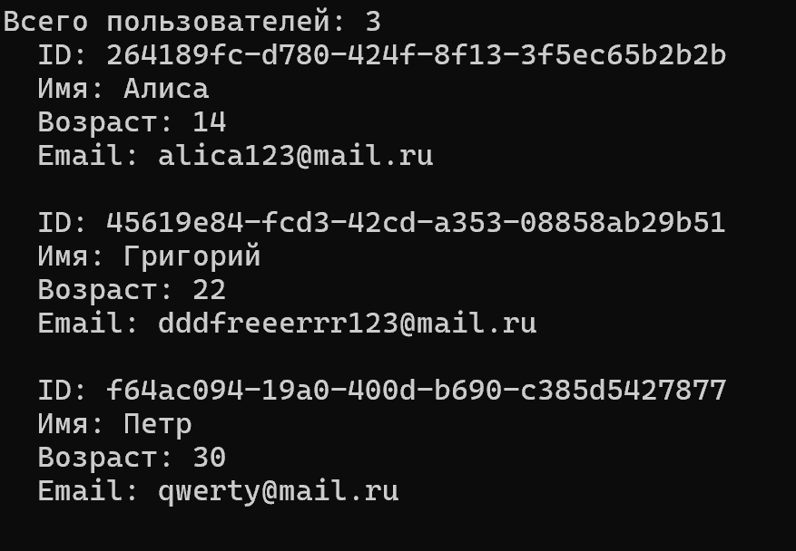
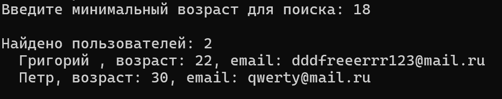

# Документация по проектной практике

## Цель работы

Цель — приобретение первичных профессиональных навыков работы с системами контроля версий, языками разметки, основами веб-разработки, а также изучение принципов хранения данных и разработки собственной файловой базы данных на языке C#.

## Задачи практики

- Освоить базовые операции системы контроля версий Git
- Изучить синтаксис Markdown для оформления документации
- Разработать статический веб-сайт с использованием HTML и CSS
- Изучить принципы сериализации данных в JSON
- Спроектировать архитектуру файловой базы данных
- Реализовать операции создания, чтения, обновления и удаления данных
- Добавить возможность поиска записей по условию
- Протестировать работоспособность на примере нескольких классов
- Подготовить техническое руководство


## 1. Настройка Git и репозитория

Был создан личный репозиторий на платформе GitHub. Освоены основные команды:

```bash
git clone <url>
git checkout -b новая-ветка
git add .
git commit -m "Описание изменений"
git push
```
Репозиторий имеет четкую структуру согласно заданию. Все изменения фиксируются с осмысленными сообщениями.


## 2. Документирование в Markdown

В ходе практики изучены и применены:

- Заголовки уровней 1–3
- Форматирование текста: **жирный**, *курсив*
- Нумерованные и маркированные списки
- Ссылки и изображения
- Таблицы
- Блоки кода

Пример таблицы:

| Название | Описание |
|----------|----------|
| IEntity | Интерфейс сущности с обязательным идентификатором |
| DataBase | Основной класс для работы с таблицами |


## 3. Статический веб-сайт

Стек: HTML5, CSS3.

Разработаны страницы:

- Главная — краткая аннотация проекта
- О проекте — цели, задачи, архитектура базы данных
- Участники — моя роль в проекте
- Журнал — записи о ходе работы
- Ресурсы — полезные ссылки на документацию по C#, JSON и Git

Сайт размещен в папке site.


## 4. Исследование предметной области

Перед началом разработки было проведено исследование способов создания собственных баз данных. Изучены материалы репозитория build-your-own-x, статьи по сериализации в JSON и архитектуре файловых хранилищ.

Рассмотрены два подхода:

1. Хранение данных в одном JSON-файле (массив объектов). Минус: при росте данных файл становится громоздким, сложно обновлять отдельные записи.

2. Хранение каждой записи в отдельном JSON-файле, сгруппированных по папкам-таблицам. Плюсы: простая реализация CRUD, независимость записей, читаемость структуры на диске.

Выбран второй подход. Для сериализации выбрана библиотека System.Text.Json как встроенная в .NET, не требующая дополнительных зависимостей. Для уникальной идентификации записей используется GUID.


## 5. Архитектура базы данных

### 5.1 Описание классов

- IEntity — интерфейс с обязательным свойством Guid Id
- DataBase — ядро, принимает путь к корневой папке, содержит методы:
  - Save — создает или обновляет запись
  - Load — загружает одну запись
  - LoadAll — загружает все записи таблицы
  - Delete — удаляет запись
  - DeleteAll — очищает таблицу
  - Find — поиск по условию

Имя таблицы определяется именем типа T. Файлы сохраняются в папку rootPath/TableName/Id.json.


## 6. Техническое руководство для начинающих

### 6.1 Что такое файловая база данных

Файловая база данных — это способ хранения данных, при котором каждая таблица представлена папкой на диске, а каждая запись в таблице — отдельным файлом в формате JSON. Такой подход не требует установки сервера баз данных и идеально подходит для обучения.

### 6.2 Как создать свою базу данных с нуля

#### Шаг 1: Создайте интерфейс сущности

Все объекты, которые будут храниться в базе, должны иметь уникальный идентификатор:

```csharp
public interface IEntity
{
    Guid Id { get; set; }
}
```

#### Шаг 2: Создайте класс Database

Это ядро базы данных. Оно принимает путь к корневой папке:

```csharp
public class DataBase
{
    private readonly string _rootPath;
    
    public DataBase(string rootPath)
    {
        _rootPath = rootPath;
        if (!Directory.Exists(_rootPath))
            Directory.CreateDirectory(_rootPath);
    }
}
```

#### Шаг 3: Реализуйте метод Save

Имя папки берется из имени типа T:

`string tablePath = Path.Combine(_rootPath, typeof(T).Name);`

Если Id пустой — генерируем новый:

`if (entity.Id == Guid.Empty) entity.Id = Guid.NewGuid();`

Сериализуем объект и записываем в файл:

`string json = JsonSerializer.Serialize(entity);`

`File.WriteAllText(filePath, json);`

#### Шаг 4: Остальные методы

**LoadAll** — читает все JSON-файлы из папки таблицы и возвращает список объектов.

**Delete** — удаляет файл записи по ID.

**DeleteAll** — удаляет всю папку таблицы.

**Find** — загружает все записи и фильтрует через LINQ:


### 6.5 Тестирование

Для проверки работы базы данных создано консольное приложение с текстовым меню. Оно позволяет:

- Добавлять объекты User и Product
- Находить записи по ID
- Просматривать все записи таблицы
- Фильтровать по условию
- Удалять записи

Все операции протестированы и работают корректно. Скриншоты работы приложения приведены ниже.

<p align="center">
  <br>
  <i>Рис. 3 – Просмотр содержимого базы данных</i>
</p>

<p align="center">
  <br>
  <i>Рис. 4 – Поиск объектов с фильтром</i>
</p>


## 7. Модификация проекта

В процессе работы над проектом была добавлена возможность, которой не было в изначальной версии:

**Метод DeleteAll** — позволяет очистить всю таблицу целиком, удалив папку с JSON-файлами. Это удобно при тестировании и сбросе данных.

```csharp
public void DeleteAll<T>() where T : IEntity
{
    string tablePath = Path.Combine(_rootPath, typeof(T).Name);
    if (Directory.Exists(tablePath))
        Directory.Delete(tablePath, true);
}
```


## 9. Хронология этапов работы

| Дни | Этап |
|--------|------|
| 1 | Создание репозитория, настройка Git, изучение Markdown |
| 2 | Исследование подходов к созданию баз данных, проектирование архитектуры |
| 3 | Реализация класса DataBase, методов Save и Load |
| 4 | Реализация LoadAll, Delete, DeleteAll, Find |
| 5 | Создание моделей User и Product |
| 6 | Разработка консольного приложения с меню |
| 7 | Тестирование, исправление ошибок |
| 8 | Создание статического веб-сайта |
| 9 | Оформление документации, написание отчета |
---

## 10. Результаты работы

- Освоены Git и Markdown
- Создан статический веб-сайт
- Разработана собственная файловая база данных на C#, поддерживающая:
  - хранение любых типов, реализующих IEntity
  - полный набор CRUD-операций
  - поиск по предикату
- Подготовлено техническое руководство (настоящий документ)


## Заключение

Практика позволила приобрести навыки работы с современными инструментами разработки и документирования. Реализация базы данных с нуля углубила понимание принципов хранения данных, сериализации и работы с файловой системой в C#. Проект может быть расширен индексами, кэшированием и поддержкой связей между таблицами.


## Приложения

- Скриншоты работы программы размещены в site/images и docs/images
- Исходный код — src
